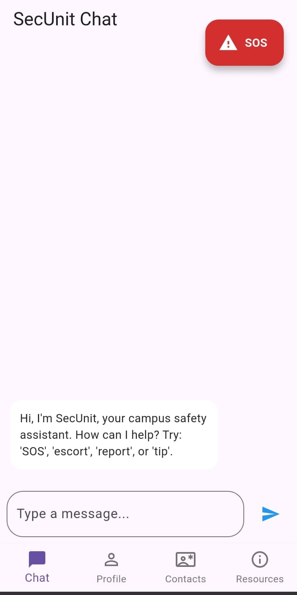
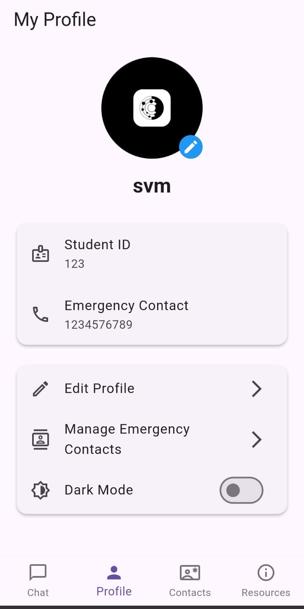
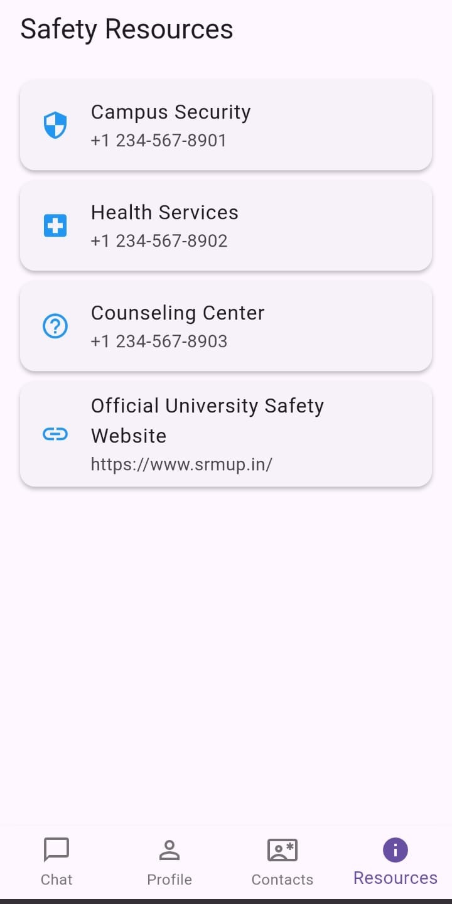

<!-- LOGO -->

<p align="center">
  
</p>

<h1 align="center">SecUnit: Campus Safety App</h1>

<p align="center">
  A comprehensive Flutter mobile app that enhances personal safety for students on university campuses.
</p>

<p align="center">
  <a href="#getting-started">Getting Started</a> •
  <a href="#features">Features</a> •
  <a href="#architecture">Architecture</a> •
  <a href="#configuration--permissions">Configuration & Permissions</a> •
  <a href="#contributing">Contributing</a>
</p>

<p align="center">
  
  
</p>

---

## Overview

**SecUnit** is a Flutter-based campus safety companion. It combines essential security tools with a clean, modern UI (supporting light and dark themes) to help students stay safe, informed, and connected during routine and urgent situations.

---

## Features

* 🤖 **AI Safety Chatbot**: Instantly answers safety-related questions. Recognizes keywords such as `SOS`, `escort`, `report`, `unsafe`, and more to provide guidance.
* 👤 **User Profiles**: Store your name, student ID, profile picture, and an emergency contact number.
* 🆘 **Emergency Contacts**: Maintain a quick-dial list for urgent situations.
* 📚 **Safety Resources**: Curated campus resources—security, health services, counseling, and key phone numbers.
* 🎨 **Professional UI + Dark Mode**: Clean, modern interface with light/dark themes.

> **Planned (Roadmap)**
>
> * 🔔 Push notifications for campus alerts
> * 🗺️ Campus map with safe routes & escorts
> * 📍 Optional live location share to trusted contacts
> * 🧠 On-device intent detection for offline guidance
> * 🧪 In-app incident reporting with photo attachments

---

## Screenshots

  


```
assets/
    ├── secunitlogo.png
    ├── chat.jpg
    ├── profile.jpg
    └── resourses.jpg
```

---

## Tech Stack & Key Packages

* **Flutter** (>= 3.x)
* **State Management**: `provider` – theme toggling and simple app state
* **Local Storage**: `shared_preferences` – profile data, settings, emergency contacts
* **Media**: `image_picker` – profile photos from gallery/camera
* **Dev Tooling**: `flutter_launcher_icons` – generate platform launcher icons

<details>
  <summary><strong>Example pubspec.yaml excerpt</strong></summary>

```yaml
dependencies:
  flutter: { sdk: flutter }
  provider: ^6.0.0
  shared_preferences: ^2.2.0
  image_picker: ^1.0.0

dev_dependencies:
  flutter_launcher_icons: ^0.13.1

flutter_icons:
  android: true
  ios: true
  image_path: assets/icon/icon.png
```

</details>

---

## Getting Started

### Prerequisites

* Install the **Flutter SDK** and set up Android/iOS tooling.
* Verify your environment:

```bash
flutter --version
flutter doctor
```

### Installation

```bash
# 1) Clone the repository
git clone https://github.com/svm00/secunit.git
cd secunit

# 2) Install dependencies
flutter pub get

# 3) (Optional) Generate app icons from assets/icon/icon.png
flutter pub run flutter_launcher_icons:main

# 4) Run the app on a device or simulator
flutter run
```

> If you use multiple devices, list them with `flutter devices` and target with `-d <deviceId>`.


**Chatbot Intent Handling (example)**

```
Intent: SOS        → Show emergency actions (call campus security, share location*)
Intent: escort     → Display campus escort service info & direct call action
Intent: report     → Open incident report form (draft offline, submit when online*)
Intent: unsafe     → Provide safety tips, quick contact buttons, and resource links
```

\*Optional features depend on roadmap items.

---

## Configuration & Permissions

### App Configuration

* **Branding**: Update `assets/secunit-logo.png` and splash screen settings as needed.

### Privacy

* SecUnit stores profile data and contacts **locally on the device** using `shared_preferences`.
* No backend or analytics are enabled by default. If you integrate any, document data flow and opt-in.

---

## Testing

```bash
# Unit & widget tests
flutter test

# Linting (example)
flutter analyze
```

## Troubleshooting

* **iOS build fails for icons**: Ensure `flutter_launcher_icons` matches your Flutter/Dart versions and the icon path exists.
* **Image Picker permissions**: Add the iOS `Info.plist` keys and Android manifest permissions.
* **Gradle/AndroidX issues**: Run `flutter clean && flutter pub get` and ensure SDK versions in `android/` are consistent.

---

## Contributing

Contributions make the community awesome! 🎉

1. **Fork** the project
2. **Create your feature branch**

   ```bash
   git checkout -b feature/AmazingFeature
   ```
3. **Commit your changes**

   ```bash
   git commit -m "feat: add AmazingFeature"
   ```
4. **Push to your branch**

   ```bash
   git push origin feature/AmazingFeature
   ```
5. **Open a Pull Request** with the `enhancement` label when appropriate

**Commit Convention (suggested)**: `feat`, `fix`, `docs`, `chore`, `refactor`, `test`, `ci`.

---

## Acknowledgements

* Flutter & Dart teams
* Open-source package authors (`provider`, `shared_preferences`, `image_picker`, `flutter_launcher_icons`)

---

## FAQ

**Q: Does the app work offline?**
A: Yes. Core features (profile, contacts, resources, theme) are offline. Roadmap items like alerts may require connectivity.

**Q: Where is my data stored?**
A: On-device via `shared_preferences`. No data leaves your device unless you integrate additional services.

**Q: Can I use my university’s branding?**
A: Yes—replace icons, splash, and colors. Confirm with your institution’s brand guidelines.

